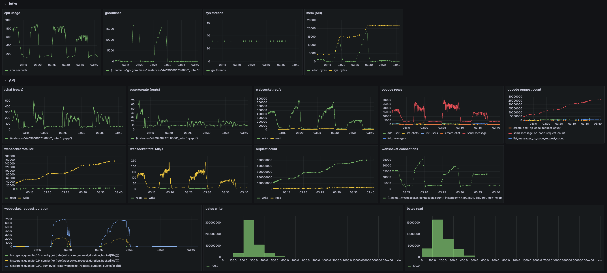

# Grafana

# Perf

Goal: simulate 1 billion MAU with 1 trillion messages per month
Current basic mvp: max throughput 600msg/s (1.5B messages per month)

# basic TODO:
- [ ] out of curisity squeze more perf from sqlite and postgresql
- [ ] separate websocket communication layer from core logic
- [ ] settle on a load simulation config, and request confirmation metrics
- [ ] try out Cassandra & ScyllaDB
- [ ] put a caching layer and batch db operations
- [ ] add inter server communication and horizontal scaling
- [ ] add message/chat sharding

idk
- [ ] proper chat client, better usability, encryption, safety guruantees, failure recovery, accurate user behaviour simulation