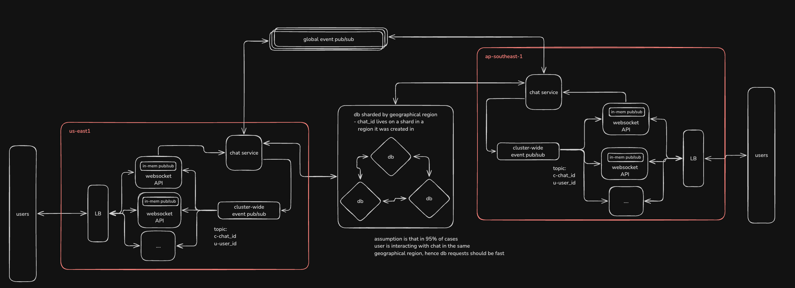

### Goal: simulate 1 billion MAU with 1 trillion messages per month
#### Current basic mvp: max throughput 2000msg/s (5B messages per month)

# observability dashboard (grafana + prometheus)

# Current (draft) system design

# next immediate tasks:
- [ ] move to ScyllaDB
- [ ] move to zero-copy IO websockets with poller design
- [ ] intra-server event pub/sub with broadcast (assumes 1 server for now)

# basic TODO:
- [ ] out of curisity squeze more perf from sqlite and postgresql
- [ ] separate websocket communication layer from core logic
- [ ] settle on a load simulation config, and request confirmation metrics
- [ ] try out Cassandra & ScyllaDB
- [ ] put a caching layer and batch db operations
- [ ] add inter server communication and horizontal scaling
- [ ] add message/chat sharding

idk about this:
- [ ] proper chat client, better usability, encryption, safety guruantees, failure recovery, accurate user behaviour simulation